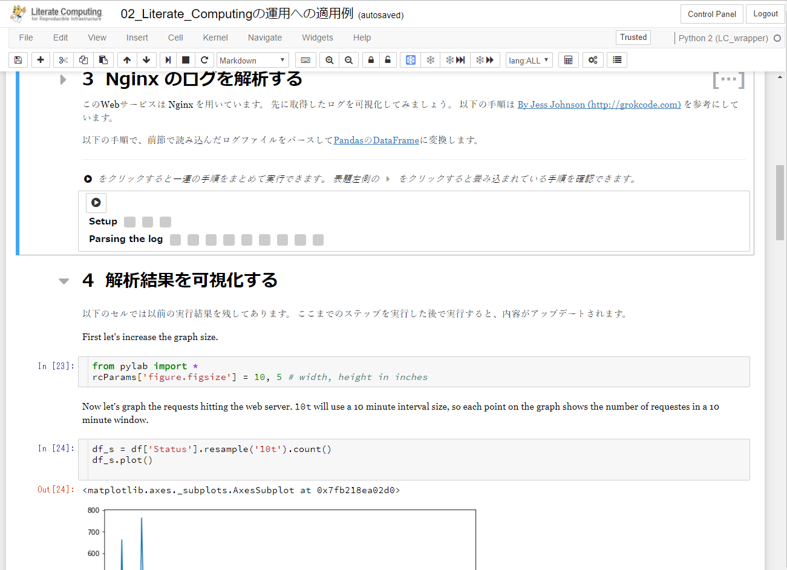
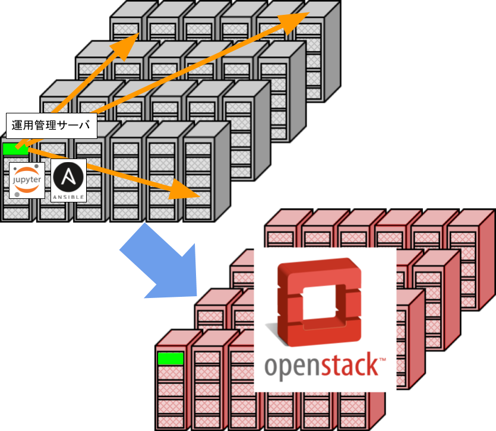

# Literate Computing for Reproducible Infrastructure
# 再構築可能なインフラのための文芸的コンピューティング
## 長久勝「人を救うはずの自動化が人を置き去りにしている」

photograph by [Shoiji Nakamura](http://nigoro.jp/ja/)

45歳。コードを書くことを生業とするには決して若くない。東京ゲームショウ2017、インディーゲームコーナー。さまざまな国籍の若いゲーム開発者がひしめく一画に、長久は2年ぶりに帰ってきた。

「ここに出展している作品の多くは、数人のチームで作られているんですよ。道具が良くなりましたからね。僕のキャリアのスタートもゲーム会社のインハウスツール開発だったので、感慨深いものがあります。ただ、昔に比べると、今の若い人は、勉強することが多くて大変だな、と思うことはあります。」

多くのソフトウェアがネットワークを介してサービスを提供するようになったため、多くの開発が運用を意識するようになり、そのさまざまなプラクティスを総称して「DevOps」と呼んでいる。ビルド、テスト、デプロイ、運用の自動化は、その中心に位置付けられている。自動化によって、少人数での運用や、コストを抑えた大規模運用が行えるようになった。

「自動化を志向したプラクティスがなければ、現代的なオンラインゲームの運用は無理でしょうね。だから、とにかく可能なタスクを片っ端から自動化しようとしてしまう。でもそれは、問題を少し小さくするかわりに、新しい属人性を生み出している場合もあります。Jenkinsおじさんとかね。」

コードレビューの経験がある人なら、属人性を排するために、技術や問題意識を共有する活動のコストは、よくご存じだろう。それは、払われるべきコストだ。運用の自動化におけるそれはどうか？

「まず、Linuxの操作というレベルから差が出ますよね。プログラミングを教えてくれる学校はあるけど、システム運用を教えてくれる学校はないんです。僕は、全部のレイヤを見ないと仕事にならない環境で育ってきましたけど、サーバのコード書いてるのにIDE上でしか動作確認したことがない人とか、納品された手順書に書いてあることしかできない人とか、分断された守備範囲にこもって仕事をしている人がたくさんいます。そんな状況で、日次タスクとして自動化されたシェルスクリプトがあったとして、皆、読めますか？問題が起こった時に修正できますか？無理ですよね。」

アジャイルの文脈では、属人性の排除は多能工化で行うという方向性がある。多能工化は、チームのレジリエンスを高める効果があるが、アウトプットの量を増やす方向には寄与しにくいため、取り組みにくい。例えば、チーム内での業務分担や人材そのものをローテーションするプラクティスがあるが、業務が忙しくなると回らなくなることがある。

これに対して自動化は、チームのアウトプットが増えることを観測しやすいため、取り組みやすい。職人として心を込めて手作業でないと困る、などの特殊な事情がない限り、自動化が評価されないケースはないだろう。ただ、jenkinsおじさん爆誕のような、チームのレジリエンスを下げる、硬直化、現状業務への過度な最適化、という見えにくい不具合を、ひそかにチームに埋め込むことがある。

「自動化は、すごくいいんです。僕もさんざんやってきて、効果も分かってる。でも、ビルド・デプロイのスクリプトを自分しかメンテできてない状況も経験して、あ、何か足りない、って思っちゃった。」

長久ら、[国立情報学研究所](https://www.nii.ac.jp/)クラウド運用チームは「Literate Computing for Reproducible Infrastructure（再構築可能なインフラのための文芸的コンピューティング）」を提唱している。2014年度の研究用ベアメタルクラウド基盤構築において、メンバーの[政谷](https://conferences.oreilly.com/jupyter/jup-ny/public/schedule/speaker/197779)が提案した、運用ドキュメントをNotebook形式（当時のIPython Notebook、現Jupyter Notebook、で実行できる形）で納品してもらう、というアイデアからスタートしたこの方法論は、構築・運用作業のためのJupyter Notebookの拡張や、Notebookに基づく運用作業、Notebookを使って何度でも再構築可能な研究用ベアメタルクラウド基盤の開発と、チームの実践を経て形作られてきた。

Notebookインタフェースは、コードとドキュメント、更にはその実行結果を、すべてまとめて1つの文書として扱う形式の総称だ。ドナルド・クヌースの文芸的プログラミングに影響を受けて成立した。Pythonの対話型インタフェースであるIPythonの開発者フェルナンド・ペレスは、webベースのIPythonのNotebookインタフェースを開発した。2013年、ペレスは、ブログや論文で、文芸的プログラミングの概念をコンピュータ利用に拡張する「Literate Computing」について言及している。

「Notebook内のコード部分を順番に最後まで実行する方法はあるので、何らかのスケジューラと組み合わせれば、普通に自動化になります。Notebook内のそれぞれのコード部分が、何故そうなっているのか、マークダウンによるドキュメントも併記できます。実際の運用では、システムやチームに固有の事情で、イレギュラーなスクリプトを書くこともあるじゃないですか。そうした時に、その固有の事情を書き残しておけば、他のメンバが読む時の手掛かりになります。あと、年に1回しかやらない作業。忘れちゃうwww 自分のための備忘としても機能しますね。」

国立情報学研究所クラウド運用チームは、魔改造したJupyter Notebookの他、HadoopやElasticSearchの構築運用Notebookなど、これまでの成果物を公開している。

[GitHub](https://github.com/NII-cloud-operation)

[DockerHub](https://hub.docker.com/u/niicloudoperation/)

「人を救うはずの自動化が人を置き去りにしている。それを何とかしたいですね。」

----

## 事例：再構築可能な研究用ベアメタルクラウド基盤

ネットワークなど最低限の設定が施されたスイッチやサーバの群に対して、運用管理サーバ上のJupyterからNotebookベースの作業で、クラウド基盤を構築できる。手順がNotebook化されているため、何度でも再構築可能である。

運用もNotebookベースである。作業の証跡を残すため、作業用のNotebookは、各作業の雛型になるものをコピーして使用し、実行結果付きで保存する。

----

## WIP：イベント用WiFiネットワークの構築

「Literate Computing for Reproducible Infrastructure」のデモとして、イベント会場で一時的に構築され提供されるWiFiネットワークを構築するためのNotebookを書く。Ansibleに対応したWiFiルータの入手が[容易になりつつ](https://page.auctions.yahoo.co.jp/jp/auction/t535192923)あり、[安価なPoEスイッチ](https://www.amazon.co.jp/gp/product/B01ABQIH9I/)もあることから、実際的な問題を解決できるソリューションになり得る。決して個人的な趣味ではなく、あくまで、「Literate Computing for Reproducible Infrastructure」の普及のためである。

----

## デモ：Evaluation Tracer

決して個人的な趣味ではなく、あくまで、「Literate Computing for Reproducible Infrastructure」の普及のためである。なので無理矢理Ansible入れた。ほんとだよ。

